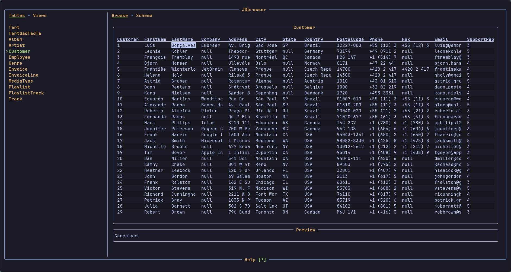
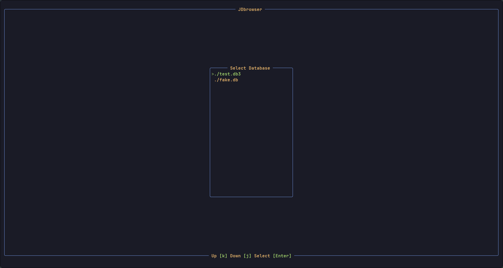
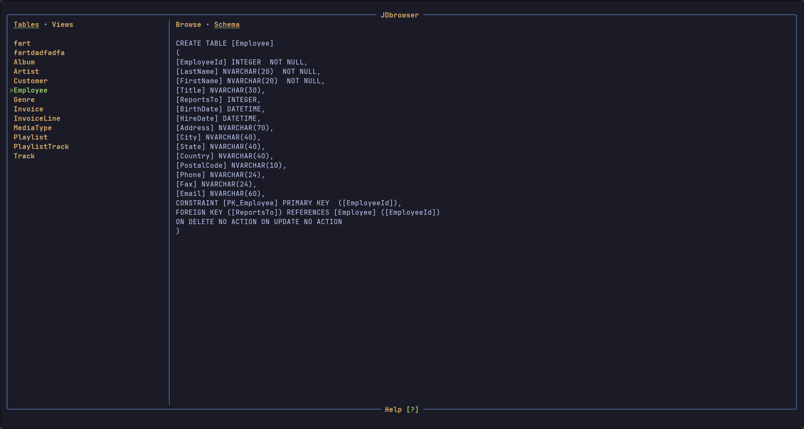

# JDbrowser - Terminal TUI Sqlite Browser V1.3

Browse an Sqlite database from the terminal with a text user interface.

 

# Usage

- Run the application from the directory containing the database.

- Select your database from the initial file menu.

- Use the keybindings to browse the tables and views of your database.

- Copy data to clipboard with `y` key. ( On wayland clipboard text is cleared after exiting JDbrowser )


## Key Binds

### General

| Action | Keybind |
| -------------- | --------------- |
| Exit Application                        | Escape      |
| Help Menu Open/Close | ?| 

### File Menu

| Action | Keybind |
| ------------- | -------------- |
| Up        |  k        |
| Down      |  j        |
| Select    |  Enter    |

### Main view left side navigation

| Action | Keybind |
| ------------- | -------------- |
| Show Table/Views        |  q, e        |
| Up        |  shift + k        |
| Down      |  shift + j        |

### Table View

| Action | Keybind |
| ------------- | -------------- |
| View Data/Schema        |  shift + h, l        |
| Page Up / Down Half |  u, d |  
| Move Cell Up | k    |
|    Move Cell Down | j |
| Move Cell Left| h |
| Move Cell Right | l |
| Yank Cell to Clipboard | y |


# Installation and Building

No configuration needed.

### Arch Linux

You can install JDbrowser from the AUR. Example using yay.

```bash
yay -S jdbrowser-git
```

### Download Binary

Binaries are available for download [Here](https://github.com/Jkeyuk/JDbrowser/releases) 

Simply download the binary run `chmod +x ./jdbrowser` and use where ever you want.

### Install With Rust

A simple way to install the binary using Rust:

```bash
cargo install --path .
```

### Build with Rust

A binary can also be directly built with:

```bash
cargo build --release 
```

or:

64-bit Linux (kernel 3.2+, glibc 2.17+)

```bash
cargo build --release --target x86_64-unknown-linux-gnu 
```


The binary will be available at ***target/release/jdbrowser***

# Screen Shots

 

 

# TODO

- error handling popup
- handle blob data
